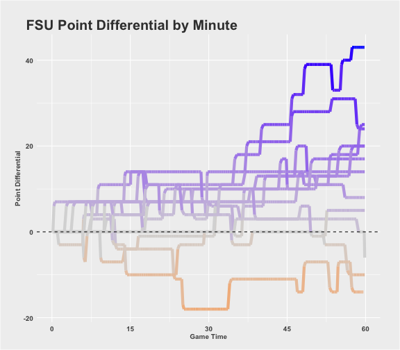
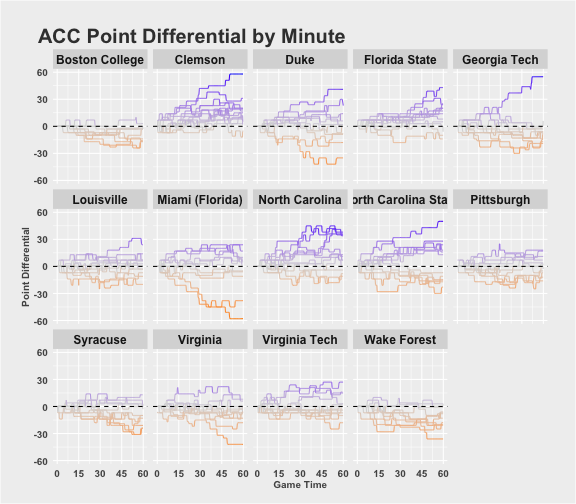

# CFB Point Differential Charts

I Have seen some great visualizations lately that show the play-by-play point differential for [the NBA](http://roadtolarissa.com/nba-minutes/) and [the NFL](https://public.tableau.com/s/gallery/nfl-2015-regular-season) and I wanted to recreate that for College Football. You can view all the source code [on github](https://github.com/mattmills49/CFB_Analysis/tree/master/Point_Diff_Shiny) and a huge thanks to the [r/CFBAnalysis](https://www.reddit.com/r/CFBAnalysis/) subreddit for handling the scraping to pull the college football play by play. It's all open source and you can find the data for the 2015 season [here](https://www.dropbox.com/sh/3mtji4sad37tb9h/AABps7Si9-ALlgeBnc0i3Ytha?dl=0). In addition I created an interactive shiny app to view all the graphs for any team or conference, you can check that out [here](https://mattmills49.shinyapps.io/Point_Diff_Shiny/).

I'm going to show you all the R code and will explain things as I see necessary but if you would like some further clarification please just reach out to me on twitter or email. 


```r
# Read in packages
library(readr) 
library(stringr)
library(ggplot2) 
library(dplyr)
library(shiny) # only needed for the shiny app
library(ggiraph) # only needed for interactive graphs
options(dplyr.width = Inf)
source("data/helper_functions.r")
```

The `helper_functions.r` code (found in the github repo) contains a function called `AddTime` that estimates the time of each play in the play by play data, which only include times at the start and end of each drive. It also includes the 538 style ggplot2 theme that Austin Clemens provided [here](http://austinclemens.com/blog/2014/07/03/fivethirtyeight-com-style-graphs-in-ggplot2/) (with some small changes). 

### Read in the Data

For this project I only need the play by play data (`play.csv`) and the team and conference names. Also for some reason the column names have spaces in them, so I replace all of the spaces with underscores. 


```r
play_df <- read_csv(file = "data/play.csv")
conf_df <- read_csv(file = "data/conference.csv")
team_df <- read_csv(file = "data/team.csv")

names(play_df) <- str_replace_all(names(play_df), " ", "_")
names(conf_df) <- str_replace_all(names(conf_df), " ", "_")
names(team_df) <- str_replace_all(names(team_df), " ", "_")
names(team_df)[2] <- "Team_Name"
names(conf_df)[2] <- "Conf_Name"

play_df <- AddTime(play_df)
play_df <- select(play_df, -scoreTextVector, -driveTextVector)
```

Here is a sample of the play by play data


|  Game_Code   | Play_Number | Period_Number | Clock | Offense_Team_Code | Defense_Team_Code |
|:------------:|:-----------:|:-------------:|:-----:|:-----------------:|:-----------------:|
| 2.310128e+14 |      1      |       1       |  900  |        231        |        128        |
| 2.310128e+14 |      2      |       1       |  NA   |        128        |        231        |
| 2.310128e+14 |      3      |       1       |  NA   |        128        |        231        |
| 2.310128e+14 |      4      |       1       |  NA   |        128        |        231        |

In order to visualize the whole game for a team, not just when they are on offense, I need to "duplicate" each game so there are records for both teams no matter who is on offense and defense. I also want to get the actual team names instead of the codes and I want some info on the opponent to use for our interactive graphs later. Some of the team names need to be "fixed" for the `ggiraph` package to produce the interactive plots. 


```r
team_df$Team_Name <- team_df$Team_Name %>%
  str_replace_all(fixed("\xa0"), "") %>%
  str_replace_all(fixed("'"), "")

team_conf_df <- left_join(team_df, conf_df, by = c("Conference_Code"))

games <- select(play_df, Game_Code, Offense_Team_Code, Defense_Team_Code) %>%
  distinct %>%
  rename(Team = Offense_Team_Code, Opponent = Defense_Team_Code) %>%
  left_join(team_conf_df, by = c("Team" = "Team_Code")) %>%
  left_join(select(team_conf_df, Team_Code, Team_Name, Subdivision) %>% rename(Opponent_Name = Team_Name, Opp_Sub = Subdivision), by = c("Opponent" = "Team_Code"))

knitr::kable(head(select(games,1:6), 4), align = "c")
```


|  Game_Code   | Team | Opponent |       Team_Name       | Conference_Code |          Conf_Name           |
|:------------:|:----:|:--------:|:---------------------:|:---------------:|:----------------------------:|
| 2.310128e+14 | 231  |   128    | Florida International |      24312      |        Conference USA        |
| 2.310128e+14 | 128  |   231    |          UCF          |       823       | American Athletic Conference |
| 4.570648e+14 | 457  |   648    |    North Carolina     |       821       |  Atlantic Coast Conference   |
| 4.570648e+14 | 648  |   457    |    South Carolina     |       911       |   Southeastern Conference    |

Now I can merge the game info with the play by play to have a record for each and every team. I also want to remove Kickoffs since the data records it as the team that is kicking is on offense and it make the charts look funky to switch possessions so quickly. I also want to remove overtime games and any games against FCS teams. 


```r
plot_df <- left_join(games, play_df, by = c("Game_Code")) %>%
  filter(Play_Type != "KICKOFF", Period_Number <= 4, Subdivision != "FCS", Opp_Sub != "FCS") %>%
  mutate(Point_Diff = ifelse(Team == Offense_Team_Code, Offense_Points - Defense_Points, Defense_Points - Offense_Points),
         Time_Remaining = New.Clock + (4 - Period_Number) * 900,
         Min_Elapsed = 60 - Time_Remaining / 60,
         tooltip = ifelse(Team == Offense_Team_Code, str_c(Opponent_Name, ": ", Offense_Points, " - ", Defense_Points), str_c(Opponent_Name, ": ", Defense_Points, " - ", Offense_Points)))

filter(plot_df, Team_Name == "Florida State") %>%
  ggplot(aes(x = Min_Elapsed, y = Point_Diff, group = Opponent, color = Point_Diff)) +
  geom_line(size = 2) +
  geom_hline(yintercept = 0, linetype = "dashed") + theme(legend.position = "none") +
  theme_538 +
  scale_color_gradient2(low = "darkorange", high = "blue", mid = "grey85", midpoint = 0) +
  ggtitle("FSU Point Differential by Minute") +
  ylab("Point Differential") +
  scale_x_continuous(name = "Game Time", breaks = seq(0, 60, by = 15))
```



```r
filter(plot_df, Conf_Name == "Atlantic Coast Conference") %>%
  ggplot(aes(x = Min_Elapsed, y = Point_Diff, group = Opponent, color = Point_Diff)) +
  geom_line() +
  facet_wrap(~Team_Name, nrow = 3) +
  geom_hline(yintercept = 0, linetype = "dashed") + theme(legend.position = "none") +
  theme_538 +
  scale_color_gradient2(low = "darkorange", high = "blue", mid = "grey85", midpoint = 0) +
  ggtitle("ACC Point Differential by Minute") +
  ylab("Point Differential") +
  theme(strip.text = element_text(face = "bold", size = 12)) + 
  scale_x_continuous(name = "Game Time", breaks = seq(0, 60, by = 15))
```



The Shiny App takes these same graphs and makes them interactive using the `ggiraph` package, which really is phenomenal. You can view that [here!](https://mattmills49.shinyapps.io/Point_Diff_Shiny/), the interactive conference plot may be a little slow. 
