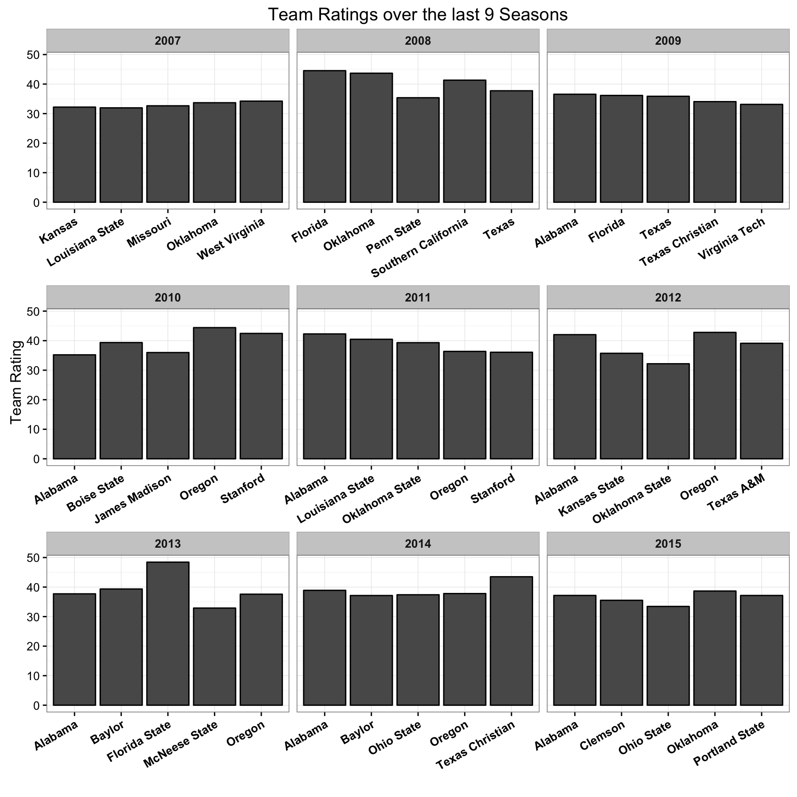

# Generate Team Quality Metrics

In order to build a prediction model for next season I need to know how good
each team was in the previous season(s). A decent and simple way to measure
team quality is to use the [Massey rankings](http://public.gettysburg.edu/~cwessell/RankingPage/massey.pdf), which basically just finds the
points above average that each team contributes to the margin of victory of 
each game using [Ordinary Least Squares Regression](https://en.wikipedia.org/wiki/Ordinary_least_squares). We will get into more complicated measures later on in this post. 

To do this, for each season, I need to organize the data so that each row 
corresponds to a game. The dependent variable (what we are trying to predict)
is the margin of victory from the view of the home team. The 
independent variables needed will be dummay variables indicating who is home 
(using a + 1) and who is away (using a -1). Normally you wold also include a
dummy variable for neutral site games, however the 2015 season on CFB 
Reference doesn't list any info on neutral site games. So even though we have
this information for every other season I'm going to have to exclude it since
the overall goal of this project is to predict the coming seasons results, so 
we can't just ignore we don't have it for this year.

Let's get started by reading in the data I've pulled from CFB Reference that
includes the results of every FBS football game over the last 10 seasons.


```r
library(readr) 
library(purrr)  
library(dplyr)
library(tidyr)
library(stringr)
library(lubridate)
library(broom)
options(dplyr.width = Inf)

raw_schedule <- read_csv(file = "~/Documents/fb_analysis/Datasets/cfb_schedule_05_15.csv",
                    col_types = cols(Date = col_date(format = "%b %d, %Y")))

## Need to add the points for the home and away teams and find what season each
## game belongs to

results <- raw_schedule %>%
  mutate(Home_Points = ifelse(Winner == Home, Winner_Points, Loser_Points),
         Away_Points = ifelse(Winner == Home, Loser_Points, Winner_Points),
         Home_MOV = Home_Points - Away_Points,
         Season = ifelse(month(Date) == 1, year(Date) - 1, year(Date))) %>%
  filter(!is.na(Home_MOV))
```

| Season| Week|Home             |Away               | Home_Points| Away_Points| Home_MOV|
|------:|----:|:----------------|:------------------|-----------:|-----------:|--------:|
|   2005|    1|Arizona State    |Temple             |          63|          16|       47|
|   2005|    1|Cincinnati       |Eastern Michigan   |          28|          26|        2|
|   2005|    1|Connecticut      |Buffalo            |          38|           0|       38|
|   2005|    1|Marshall         |William & Mary     |          36|          24|       12|
|   2005|    1|Tulsa            |Minnesota          |          10|          41|      -31|
|   2005|    1|Louisiana-Monroe |Northwestern State |          23|          27|       -4|

Now comes the tricky part. I need to turn this long data frame of game
results into a wide format that includes the team names as variable names.
I've written the following helper function to "stack" the teams in each 
game so that we don't have to worry about having two team name columns.


```r
organize_game_results <- function(df, ...){
  home_teams <- df %>%
    select(Season, Game_Num, Home, Home_MOV, ...) %>% 
    mutate(involved = 1) %>% 
    rename(Team = Home)
  away_teams <- df %>%
    select(Season, Game_Num, Away, Home_MOV, ...) %>% 
    mutate(involved = -1) %>% 
    rename(Team = Away)
  return(bind_rows(home_teams, away_teams))
}
```

I'm going to do a bit of R Kung Fu but here is my basic approach:
* ["Nest"](https://blog.rstudio.org/2016/02/02/tidyr-0-4-0/) the stacked team
data so that the data is grouped by Season. Since each season's data is just
stored as a list in a column of the data frame we can use `purrr`'s
`map` function to perform functions on each season of data seperately.
* Use the `spread` function from the `tidyr` package to go from a tall to 
wide format
* Use a linear regression to calculate the Massey Rankings
* Use the `tidy` function from the `broom` package to extract the coefficient
values (which are the actual team rankings)
* Then unnest each season to get one data frame for our results


```r
season_team_values <- results %>%
  organize_game_results %>%
  group_by(Season) %>%
  nest() %>% 
  mutate(regression_df = map(data, spread, Team, involved, fill = 0),
         model = map(regression_df, ~ lm(Home_MOV ~ . - Game_Num, data = .)),
         team_values = map(model, tidy)) %>%
  unnest(team_values) %>%
  mutate(term = str_replace_all(term, fixed("`"), ""))
```

| Season|term               |  estimate|  std.error| statistic|   p.value|
|------:|:------------------|---------:|----------:|---------:|---------:|
|   2005|(Intercept)        |  3.646571|  0.5735598|  6.357787| 0.0000000|
|   2005|Air Force          | 31.465096| 15.7468260|  1.998187| 0.0461865|
|   2005|Akron              | 27.347303| 15.5560123|  1.757989| 0.0793035|
|   2005|Alabama            | 46.604288| 15.6858803|  2.971098| 0.0030966|
|   2005|Alabama-Birmingham | 30.838248| 15.8030438|  1.951412| 0.0515135|
|   2005|Appalachian State  | 22.981138| 18.3074848|  1.255286| 0.2099059|

Let's show the top 5 teams from the last 9 years. To do this I actually have 
to center the predictions so that the average team rating in each season is
0. This is because the regression doesn't really have any reason to make the
average team value zero (or any specific value); it is just concerned with
getting difference between team ratings as close to the actial margin of
victory, not the rating values themselves.




### Problems

If you inspect the results you'll see that there are some areas where we could
improve our results. Here is a list off the top of my head:

1. We don't adjust for blowouts at all
2. We don't adjust for teams who only play 1 or 2 games all season. For
example, Portland State beat two very bad teams in 2015 but those were their
only games so they are rated as one of the best teams in the country. We 
could just consider all teams who only showed up 1-2 times as one team, sort
of as a placeholder for "FCS" teams (the lower division of CFB).
3. We don't use a penalized regression to regularize our results at all
4. We don't include any team priors from the previous season.

While I certainly believe all of these areas could help improve our results
I'd like a way to know for sure. Since the goal of this post is to determine
how good each team was in a season we can just test that. If our team ratings
accurately predict the results of games between teams then we can assume that
the ratings reflect the true quality of teams.

What we don't want to do is use the same underlying games to both generate and
test the accuracy of the team rankings, then we would be rewarding methods that
overfit to the season results and not the true underlying team quality. So we
will have to generate our team rankings and then test their accuracy on 
different sets of games. I'm going to do this using cross validation which is 
a popular way to test the accuracy of models while avoiding overfitting. 

Let's find the accuracy of this base method we have already used. I'm using 
a helper function called `safe_pred` which you can find in the raw R file I
used to write this post. It basically helps make predictions when a team 
only shows up in the training or test data but not both, which normally
would cause an error. If there is a game in the test set that we can't
predict then I just remove it which biases our results some. Since this is, 
well was, supposed to be a quick post I'm cool with that for now. 


```r
K <- 4 # number of cross validated folds
cv_results <- results %>%
  mutate(fold_id = sample(1:K, size = n(), replace = T)) %>%
  organize_game_results(fold_id) %>% 
  group_by(Season) %>%
  nest() %>% 
  crossing(fold = 1:K) %>% 
  mutate(train = map2(data, fold, function(df, fold_num) filter(df, fold_id != fold_num)),
         test = map2(data, fold, function(df, fold_num) filter(df, fold_id == fold_num)),
         regression_df = map(train, spread, Team, involved, fill = 0),
         test_df = map(test, spread, Team, involved, fill = 0),
         model = map(regression_df, ~ lm(Home_MOV ~ . - Game_Num - fold_id, data = .)),
         preds = map2(model, test_df, safe_pred),
         error = map_dbl(preds, function(df) mean((df$Home_MOV - df$pred)^2))) %>%
  group_by(Season) %>%
  summarize(mean_mse = mean(error), sd_mse = sd(error))

c(mean(cv_results$mean_mse), mean(cv_results$sd_mse))
```

```
## [1] 262.15520  21.53612
```

So that's our baseline Mean Squared Error.  

Let's try and beat it using the 2nd idea I had. The first is kind of arbitrary
(what do we define as a blowout?) and the fourth we will focus on in the actual
prediction model we are trying to build, so I don't think it's needed yet.


```r
game_list <- results %>%
  mutate(fold_id = sample(1:K, size = n(), replace = T)) %>%
  organize_game_results(fold_id)

bad_teams <- game_list %>%
  count(Season, Team) %>%
  mutate(bad_team = n <= 2)

fcs_fix_results <- game_list %>%
  left_join(bad_teams, by = c("Season", "Team")) %>%
  mutate(Team = ifelse(bad_team, "FCS", Team)) %>%
  select(-n, -bad_team) %>%
  group_by(Season) %>%
  nest() %>% 
  crossing(fold = 1:K) %>% 
  mutate(train = map2(data, fold, function(df, fold_num) filter(df, fold_id != fold_num)),
         test = map2(data, fold, function(df, fold_num) filter(df, fold_id == fold_num)),
         regression_df = map(train, spread, Team, involved, fill = 0),
         test_df = map(test, spread, Team, involved, fill = 0),
         model = map(regression_df, ~ lm(Home_MOV ~ . - Game_Num - fold_id, data = .)),
         preds = map2(model, test_df, safe_pred),
         error = map_dbl(preds, function(df) mean((df$Home_MOV - df$pred)^2))) %>%
  group_by(Season) %>%
  summarize(mean_mse = mean(error), sd_mse = sd(error))
  
c(mean(fcs_fix_results$mean_mse), mean(fcs_fix_results$sd_mse))
```

```
## [1] 264.92329  24.70148
```

Well that wasn't even an improvement, I guess since by definition those 
teams don't appear too often it really wouldn't make that much of a 
difference. What about using a penalized regression like ridge regression
to reduce the size of the coefficients? Once again we are going to need a
helper function to help us accomplish this. Also there is a bit of weird
stuff we should focus on more if we had time. For example we use cross 
validation to split the data and then more cross validation on that to find
the optimal lambda value to use in the ridge regression to predict on the 
holdout data for that fold. I don't love this idea but it's also quick and
easy so, we will worry about it later. 


```r
ridge_results <- game_list %>%
  group_by(Season) %>%
  nest() %>% 
  crossing(fold = 1:K) %>% 
  mutate(train = map2(data, fold, function(df, fold_num) filter(df, fold_id != fold_num)),
         test = map2(data, fold, function(df, fold_num) filter(df, fold_id == fold_num)),
         regression_df = map(train, spread, Team, involved, fill = 0),
         test_df = map(test, spread, Team, involved, fill = 0),
         model = map(regression_df, ridge_fit),
         preds = map2(model, test_df, ridge_pred),
         error = map_dbl(preds, function(df) mean((df$Home_MOV - df$pred)^2))) %>%
  group_by(Season) %>%
  summarize(mean_mse = mean(error), sd_mse = sd(error))

c(mean(ridge_results$mean_mse), mean(ridge_results$sd_mse))
```

```
## [1] 686.80903  84.38344
```

Wow, that's way worse than the linear regression results.

### Conclussions

So there you have it, we've shown a way to generate ratings for team quality
in a season and shown that those are about as good as we could do using the
limited data we do have. I'd love to do some more analysis around how 
variable the estimates are and other predictive models but that's not really
the goal of this poist. Also I'm pretty proud of getting that grouped cross
validation code to work using nested data frames and the `purrr` package so
I'll call it a day. As always please reach out if you have any comments or 
questions!
